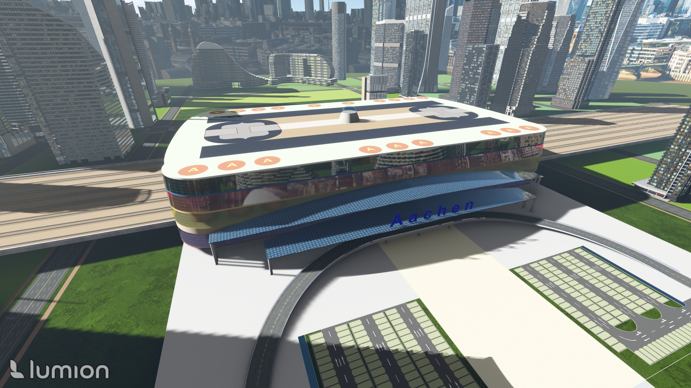
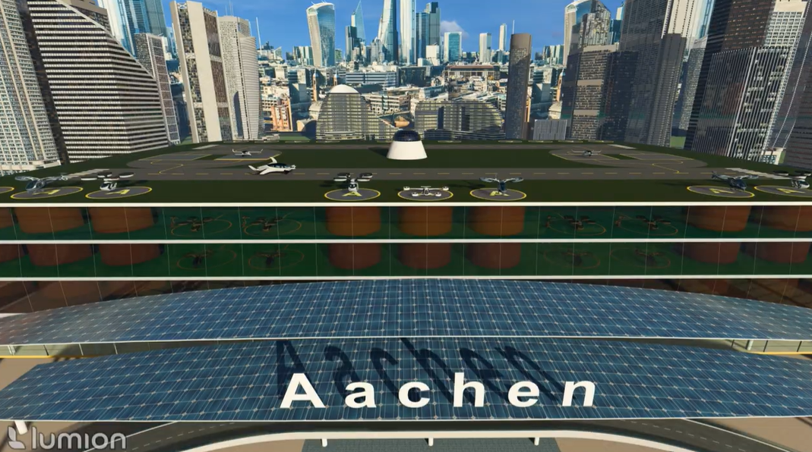
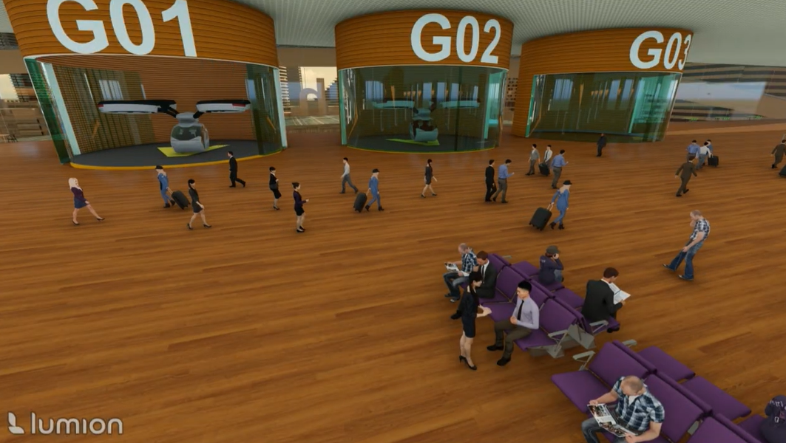

<h1 align=center >ICAO UAM Competition</h1>

<h2>Below is a collection of 3D models and high-fidelity animations created and rendered for the competition. All deliverables were independently designed and developed by me, from the initial concept and modeling stages to the final rendering and presentation.</h2>

<h3>📸 Model Gallery</h3>

<h3>🎬 Cinematic Animation</h3>

<h4>Watch the Animation for Construction</h4> https://drive.google.com/file/d/1hD3F8CT74-MD7RCmw2ctgjAAJ5cjIxS2/view?usp=drive_link

<h4>Watch the Animation for Operation</h4> https://drive.google.com/file/d/1cphloqFsOtWGIAarRP05VB_yXaZhYffm/view?usp=drive_link

